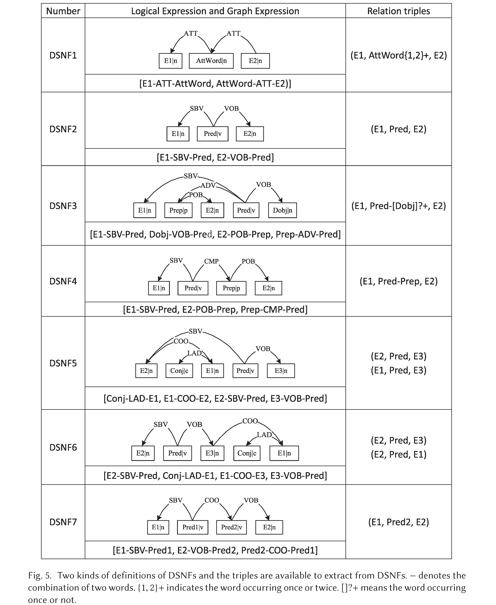

# open-entity-relation-extraction

Knowledge triples extraction (entities and relations extraction) and knowledge base construction based on dependency syntax for open domain text.

基于依存句法分析，实现面向开放域文本的知识三元组抽取（实体和关系抽取）及知识库构建。

Welcome to watch, star or fork.

## Example

> "中国国家主席习近平访问韩国，并在首尔大学发表演讲"

We can extract knowledge triples from the sentence as follows:

- (中国, 国家主席, 习近平)
- (习近平, 访问, 韩国)
- (习近平, 发表演讲, 首尔大学)

## Project Structure

```
knowledge_extraction/
|-- oer/  # code directory
|   |-- bean/
|   |-- core/
|   |-- tool/
|-- data/ # data directory
|   |-- input_text.txt  # input text file
|   |-- knowledge_triple.json  # output knowledge triples file
|-- resource  # dictionaries dirctory
|-- requirements.txt  # dependent python libraries
|-- README.md  # project description
```

## Requirements

This repo was tested on Python 3.5+. The requirements are:

Python>=3.6
- torch==1.7.1
- transformers==4.6.1
- ltp==4.1.4.post1

## Quickstart

```bash
$ python run.py
```

## Seven DSNF paradigms



## References

If you use the code, please kindly cite the following paper:

Jia S, Li M, Xiang Y. Chinese Open Relation Extraction and Knowledge Base Establishment[J]. ACM Transactions on Asian and Low-Resource Language Information Processing (TALLIP), 2018, 17(3): 15.
